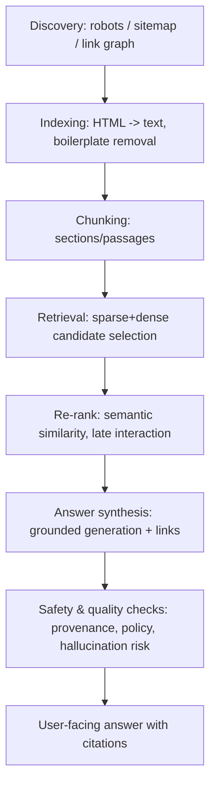
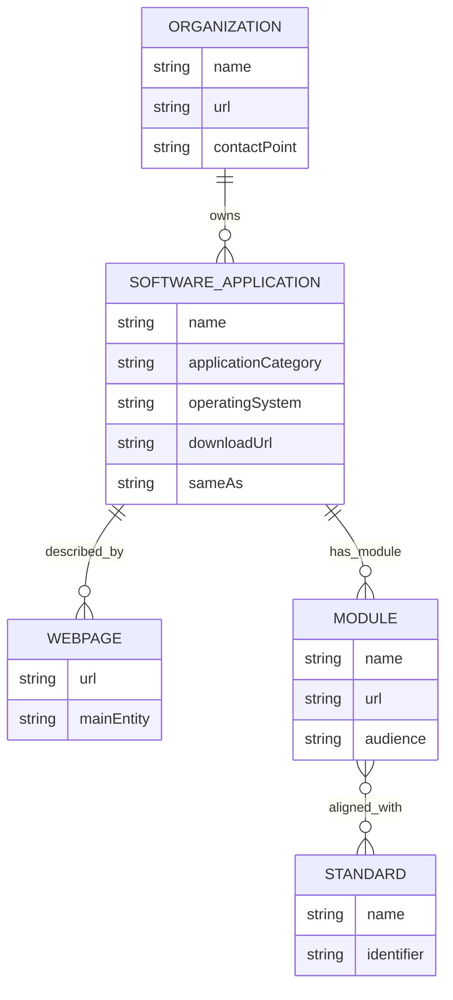
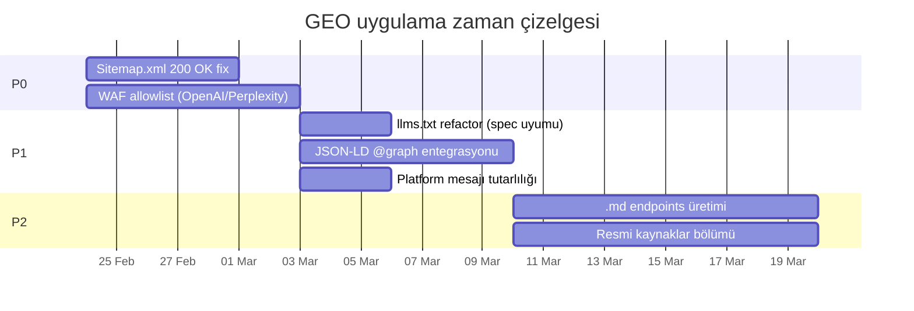

# GEO ve LLM Odaklı Website Anlaşılabilirliği ve Güven Sinyalleri

## Executive Summary

Modern “answer engine” ekosistemi (ChatGPT/Claude/Gemini/Perplexity/Copilot ve kurumsal RAG sistemleri) bir web sitesini tek bir “SEO puanı” ile değil; **erişilebilirlik (crawlability)**, **metin çıkarımı (HTML→temiz metin)**, **çok aşamalı retrieval/ranking**, **entity/knowledge graph uyumu**, **kanıtlanabilirlik (provenance)** ve **alıntılanabilirlik (quote-worthiness)** katmanlarının birleşimiyle değerlendirir. Bu nedenle GEO (Generative Engine Optimization) yaklaşımı, klasik arama motoru optimizasyonundan farklı olarak sayfanın “tamamının” değil, **LLM’lerin çekip bağlama koyacağı küçük içerik parçalarının** (chunk/passage) semantik netliğine ve güven sinyallerine odaklanır. Retrieval-augmented generation (RAG) yaklaşımının hedefi; parametre içi bilgi ile harici kaynakların birleştirilmesi, **provenance/citation** üretimi ve güncel bilgiye erişim ihtiyacıdır; bu, sitenin “LLM tarafından kaynak seçilme” ihtimalini doğrudan etkiler. citeturn7search0turn7search5turn19view0

protermify.com özelinde site; güçlü başlık hiyerarşisi, açıklayıcı tanım bölümleri, kullanıcı niyetine göre bölümlenmiş içerik (ör. “What is…”, “Key topics”, “FAQ”) ve kökte `/llms.txt` ile `/llms-full.txt` sunması bakımından GEO açısından iyi bir temel oluşturuyor. citeturn1view0turn24view1turn2view2turn4view0 Bununla birlikte **kritik bir teknik engel** var: `https://protermify.com/sitemap.xml` uç noktası crawler erişiminde **400** dönüyor; bu durum hem klasik indeksleme hem de “fan-out / agentic retrieval” benzeri süreçlerde keşfi zayıflatabilir. citeturn25view0turn5search17 Ayrıca mevcut `robots.txt` dosyası çok sayıda doğrulanmamış/belirsiz user-agent içeriyor; bot doğrulama tarafına IP allowlist stratejisi eklenmediğinde taklit (spoofing) riski de artıyor. (OpenAI ve Perplexity IP JSON uç noktaları yayımlıyor; Anthropic yayımlamıyor.) citeturn17view0turn31view2turn9view2

## Modern AI Sistemlerinde Web Kaynağı Kullanım Hattı

### Çok aşamalı retrieval ve “answer synthesis” mantığı

Bugünün modern sistemleri, bir web sitesini “okuyup” cevap üretirken çoğunlukla aşağıdaki hattı izler:

1) **Keşif (discovery)**: robots/sitemap/link grafı ile URL bulma  
2) **İndeksleme**: HTML’den metin çıkarımı, içerik temizleme, bazen render (JS/CSR)  
3) **Retrieval**: sorguya göre aday sayfa/passage seçimi (sparse + dense, re-rank)  
4) **Grounding / Answer Synthesis**: seçilen pasajlara dayanarak cevap üretme; mümkünse kaynak linkleme  
5) **Güvenlik/kalite kontrolleri**: zararlı içerik, yanlış eşleşme, provenance kontrolü, tekrar kontrol döngüsü

Bu yaklaşımın literatürdeki “RAG” model ailesi; bir LLM’in parametre içi bilgisini, dış doküman indeksinden çekilen pasajlarla birleştirerek daha “kanıtlı” ve güncellenebilir yanıt üretmeyi hedefler. citeturn7search0turn7search12 Dense retrieval tarafında dual-encoder (DPR) ve token etkileşimli re-rank (ColBERT) gibi yöntemler; “hangi pasajın” seçileceğini belirleyen asıl mekanizmalardır; bu da sayfa içi chunk yapısının niçin GEO’nun merkezinde olduğunu açıklar. citeturn7search5turn7search2

Ayrıca modern ürünlerde “agentic” desen öne çıkar: Azure AI Search dokümantasyonunda “agentic retrieval” için, karmaşık sorguların **alt sorgulara bölündüğü**, her birinin kaynaklarda çalıştırıldığı ve sonuçların **answer synthesis** ile “alıntı/citation” üreten doğal dile çevrildiği anlatılır. citeturn19view0 Google AI Overviews/AI Mode tarafında da benzer şekilde “query fan-out” tekniğiyle bir yanıt üretirken birden fazla alt sorgu çalıştırılabildiği ve daha geniş “supporting web pages” seti bulunduğu belirtilir. citeturn9view5turn18view0



### Ürün bazında “site nasıl kullanılır” farkları

- entity["company","OpenAI","ai lab, us"] tarafında “Search için” `OAI-SearchBot`, eğitim amaçlı crawling için `GPTBot` ve kullanıcı eylemiyle sayfa ziyaretleri için `ChatGPT-User` ayrımı dokümante edilir. `OAI-SearchBot`/`GPTBot` için yayımlanan IP listeleri ile allowlist önerilir. citeturn17view0turn9view0  
- entity["company","Anthropic","ai safety company"]; `Claude-SearchBot` (search kalite geliştirme) ve `Claude-User` (kullanıcı isteğiyle fetch) ayrımı yapar; `robots.txt` yönergelerine uyduğunu, `Crawl-delay` desteklediğini ve IP aralıklarını şu an yayımlamadığını belirtir. citeturn9view2  
- entity["company","Google","search and ai company"]; AI Overviews/AI Mode için “ekstra özel optimizasyon gerekmediğini” söyler; fakat fan-out tekniği ve “supporting link eligibility” için sayfanın indekslenmiş/snippet uygun olması gerektiğini vurgular. citeturn9view5turn18view0 Ayrıca `Google-Extended` token’ının, Google’ın Gemini modelleri için training ve bazı grounding kullanımlarını yönetmeye yaradığı; Search sıralamasını etkilemediği belirtilir. citeturn18view1  
- entity["company","Microsoft","software company, us"] Copilot Studio dokümantasyonu; public websites kaynağı kullanıldığında arama sonuçlarının toplanıp ayrıştırıldığını, **grounding + provenance + semantic similarity cross-check** yapıldığını ve içerik güvenliği için iki aşamalı kontrol uygulandığını anlatır. citeturn9view3turn6search0  
- entity["company","Perplexity","ai search company"]; `PerplexityBot` (search sonuçlarında siteyi linklemek) ve `Perplexity-User` (kullanıcı isteğiyle sayfa fetch) ayrımı yapar; IP JSON endpoint’leri yayımlar ve WAF’te UA+IP doğrulaması önerir. `Perplexity-User` için “genellikle robots.txt’i görmezden gelir” ifadesi özellikle kritik bir güvenlik notudur. citeturn31view0turn9view4

Bu tablo, GEO’nun neden yalnızca “daha iyi içerik” değil aynı zamanda **bot erişimi, WAF kuralı, indekslenebilirlik ve alıntılanabilir pasaj tasarımı** işi olduğunu gösterir.

## HTML Yapısı, Semantik Netlik ve LLM Okunabilirliği

### LLM’ler HTML’i nasıl “okur”

Pratikte çoğu retrieval hattı HTML’i bir tarayıcı gibi “görsel” okumaz; **metin çıkarımı** yapar: navigation, footer, tekrar eden UI elemanları, script/JS ve bazen reklam dışarıda bırakılmaya çalışılır. llms.txt önerisinin arka planında da “karmaşık HTML + navigation + JS’nin LLM-friendly metne dönüştürülmesinin zor ve hataya açık olduğu” tespiti vardır. citeturn29view0

Bu yüzden HTML’in iki katmanı GEO açısından ayrışır:

- **Semantik iskelet**: `<main>`, `<article>`, `<nav>`, başlık hiyerarşisi, section bölümlenmesi  
- **Etkileşim/agent uyumu**: buton/menü/form gibi kontrollerin ARIA ile etiketlenmesi

Özellikle “browser agent” sınıfı sistemler için ﹣ OpenAI; ChatGPT Atlas agent’ının sayfa yapısını ve interaktif öğeleri yorumlamakta ARIA rollerini/etiketlerini kullandığını açıkça söyler. citeturn27view0 Bu, CSS’in değil ama DOM/ARIA semantiğinin önemli bir “makine okunurluk” katmanı olduğunu gösterir. W3C’nin WAI-ARIA dokümantasyonu da ARIA’nın rol/state/property katmanıyla widget semantiği ve sayfa bölgelerinin tanımlanabildiğini anlatır. citeturn30search6turn30search5

### Uygulanabilir HTML iskeleti

Aşağıdaki iskelet; hem klasik botlar hem de agent tabanlı sistemler için “temiz okuma sırası” ve “parçalanabilir section” üretir:

```html
<body>
  <a class="skip-link" href="#main">İçeriğe atla</a>

  <header>
    <nav aria-label="Ana gezinme">
      <a href="/">Ana Sayfa</a>
      <a href="/pages/aviation-english">Aviation English</a>
      <a href="/pages/compare">Karşılaştırma</a>
    </nav>
  </header>

  <main id="main">
    <article>
      <header>
        <h1>IT/DevOps English</h1>
        <p id="summary">
          <strong>Tanım:</strong> IT/DevOps English; cloud, CI/CD, SRE ve ITSM terminolojisinin
          İngilizce profesyonel sözlüğüdür.
        </p>
      </header>

      <section id="what-is" aria-labelledby="what-is-h">
        <h2 id="what-is-h">Bu sayfa neyi kapsar</h2>
        <p>
          Bu bölüm, ... (tek paragrafta tek iddia / tek tanım)
        </p>
      </section>

      <section id="key-topics" aria-labelledby="key-topics-h">
        <h2 id="key-topics-h">Ana konular</h2>
        <ul>
          <li><strong>Cloud:</strong> IaaS, PaaS, SaaS</li>
          <li><strong>CI/CD:</strong> build, deploy, rollback</li>
          <li><strong>Incident:</strong> SLA, SLO, postmortem</li>
        </ul>
      </section>

      <section id="faq" aria-labelledby="faq-h">
        <h2 id="faq-h">Sık sorulan sorular</h2>

        <section id="faq-free">
          <h3>Ürün gerçekten ücretsiz mi?</h3>
          <p>Evet. ...</p>
        </section>

        <section id="faq-offline">
          <h3>Offline çalışır mı?</h3>
          <p>Evet. ...</p>
        </section>
      </section>
    </article>
  </main>

  <footer>
    <a href="/llms.txt">llms.txt</a>
    <a href="/llms-full.txt">llms-full.txt</a>
    <a href="/sitemap.xml">sitemap.xml</a>
  </footer>
</body>
```

Bu yapı GEO açısından üç kritik fayda sağlar:

- **Chunk sınırları doğal oluşur**: her `<section>` ayrı passage adayıdır.  
- **Alıntı yapılabilir paragraflar oluşur**: ilk paragraf “tanım”, sonra kapsam, sonra liste.  
- **Anchor ile hedeflenebilir**: `#faq-offline` gibi fragment’ler, agent’ların veya retrieval sistemlerinin doğru bölgeyi seçmesine yardımcı olur (özellikle “query fan-out”/alt sorgu senaryolarında). citeturn9view5turn19view0

### Semantik netlik ilkeleri

GEO’nun “semantik netlik” tarafı, LLM’in embedding tabanlı retrieval’ında önemlidir; çünkü dense retrieval, metni vektör uzayına gömerek benzerlik üzerinden aday seçer. citeturn7search5turn7search3 Bu nedenle:

- **Tanım cümleleri tek anlamlı olmalı**: “X is …” / “X şudur …” kalıbı.  
- **Kısaltma ilk geçtiğinde açılımı verilmeli**: aynı entity farklı bağlamlarda drift etmesin.  
- **Tek paragrafta tek iddia**: alıntılanabilirlik artar.  
- **Sayısal iddialar yakınına “kanıt bağlantısı”**: App Store, standart dokümanı, resmi kaynak.

Bu yaklaşım; Copilot benzeri sistemlerde yapılan “provenance/grounding check” aşamasında, iddianın kaynakla eşleşmesini de kolaylaştırır. citeturn9view3

### CSS/HTML tarafında GEO’yu bozan yaygın hatalar

- **Ana içeriği JS ile sonradan basmak (tam CSR)**: bazı crawler’lar render etmeyebilir veya gecikmeli görür. (llms.txt arka planı bu problemi net söyler.) citeturn29view0  
- **Görsel UI için metni `display:none` ile gizleyip sadece JS/tooltip ile göstermek**: metin çıkarımında kaybolur.  
- **Başlık hiyerarşisini bozmak**: her şeyi `div` içinde “bold” yapmak; chunk sınırlarını zayıflatır.  
- **Kopyalanabilirliği zorlaştırmak**: tablo içinde kritik cümleleri ikon/emojiyle bölmek; (özellikle alıntılanacak “fiyat/plan/özellik” cümlelerinde).

OpenAI’nin Atlas agent’ı için ARIA tavsiyesi; özellikle menü, buton, form gibi öğelerde role/label/state eklemenin agent etkileşimini iyileştirdiğini söyler. citeturn27view0turn30search6

## Makine Okunur Mimari, Schema ve Entity İlişkileri

### Neden structured data GEO’da kritik

“Answer engine” sistemleri çoğu zaman web’i bir arama indeksinden veya kendi indekslerinden kullanır. Bu ekosistemde structured data iki şekilde değer üretir:

1) **Entity kimliği sabitler**: “Bu ürün kim, şirket kim, aynı şey mi?” sorusunu çözer.  
2) **Makine okunur ilişki kurar**: ürün→şirket, ürün→App Store, sayfa→ana entity, vb.

Google structured data kılavuzları; JSON-LD’nin önerilen format olduğunu, `<script type="application/ld+json">` ile head/body içinde verilebildiğini belirtir. citeturn20search2turn20search1 Bu aynı zamanda LLM’lerin KG benzeri çıkarımında “hangi sayfa neyi anlatıyor” ayrımını kolaylaştırır (özellikle `mainEntityOfPage`, `sameAs`). citeturn32search0turn32search4

### JSON-LD mi, Microdata mı, RDFa mı?

Google; rich results uygunluğu için JSON-LD (önerilen), Microdata ve RDFa formatlarını desteklediğini belirtir. citeturn20search1turn20search2 Ancak GEO perspektifinde:

| Format | GEO pratikliği | Artı | Eksi |
|---|---|---|---|
| JSON-LD | En yüksek | DOM’u kirletmez; bir “@graph” ile çok entity; CMS/JS ile üretilebilir | Template disiplin ister |
| Microdata | Orta | İçerikle iç içe; bazı durumlarda “gördüğün=işaretlediğin” | HTML karmaşasını artırır; refactor zor |
| RDFa | Orta | Linked data kültürüne yakın | Uygulaması hata/karmaşıklık yaratabilir |

### protermify için önerilen entity grafı

protermify’de içerik; bir “uygulama” (Termify), bir “şirket” (BipBoo Corporation) ve bir “web sitesi” etrafında şekilleniyor. Ayrıca 6 endüstri modülü ve dayandığı standartlar var. Site içeriği “official standards” vurgusunu yoğun yapıyor. citeturn1view0turn24view0turn25view1turn4view0



Bu grafın JSON-LD karşılığı; protermify’nin arama/LLM görünürlüğünde “tekil kimlik” (identity) üretir.

### Örnek JSON-LD taslağı

Aşağıdaki taslak; `Organization` + `SoftwareApplication` + `WebSite` gibi temel entity’leri birleştirir. Schema.org; `SoftwareApplication` tipini ve `sameAs` gibi kimlik sabitleme alanlarını tanımlar. citeturn32search0turn32search4turn32search3

```html
<script type="application/ld+json">
{
  "@context": "https://schema.org",
  "@graph": [
    {
      "@type": "Organization",
      "@id": "https://protermify.com/#org",
      "name": "BipBoo Corporation",
      "url": "https://protermify.com/",
      "email": "support@protermify.com"
    },
    {
      "@type": "SoftwareApplication",
      "@id": "https://protermify.com/#app",
      "name": "Professional English: Termify",
      "applicationCategory": "EducationalApplication",
      "operatingSystem": "iOS",
      "url": "https://protermify.com/",
      "downloadUrl": "https://apps.apple.com/app/professional-english-termify/id6744872522",
      "sameAs": [
        "https://apps.apple.com/app/professional-english-termify/id6744872522"
      ],
      "owner": { "@id": "https://protermify.com/#org" }
    },
    {
      "@type": "WebSite",
      "@id": "https://protermify.com/#website",
      "url": "https://protermify.com/",
      "name": "Termify"
    }
  ]
}
</script>
```

Not: protermify’de şu an dışarıdan görülebilen içerik çıktısında JSON-LD izine rastlanmadı; bu nedenle eklemek “net yeni sinyal” olacaktır (ham HTML head’e araç kısıtı nedeniyle doğrulama sınırlı; yine de sayfa metin çıktısında `application/ld+json` görünmüyor). citeturn1view0turn11view0

### FAQ schema konusunda gerçekçi beklenti

Google, `FAQPage` rich results görünürlüğünü (özellikle 2023’ten itibaren) “well-known, authoritative government/health” siteleriyle sınırladığını vurgular. citeturn20search0turn20search3 Bu, GEO’da FAQ kullanmayın demek değildir; tam tersine, LLM’ler için **Q→A chunk** üretmek hâlâ çok değerlidir. Buradaki kritik nokta: FAQ metninin sayfada gerçekten görünür olması ve soru/cevabın tam metin halinde bulunmasıdır (Google structured data politikaları). citeturn20search1turn20search0

## Otorite, Güven, E-E-A-T ve Atıf Olasılığı

### “Güvenilir kaynak” nasıl ölçülüyor

LLM tabanlı sistemlerde güven; çoğu zaman iki katmanda kurulur:

- **Kaynak seçimi katmanı (retrieval/ranking)**: hangi sayfayı/pasajı alıyoruz?  
- **Cevap üretimi katmanı (synthesis/grounding)**: aldığımız pasaj gerçekten iddiayı destekliyor mu?

Microsoft Copilot Studio; public web kaynaklarından içerik alınca “grounding check, provenance checks ve semantic similarity cross checks” gerçekleştirdiğini açıklıyor. citeturn9view3turn6search0 Bu tür mekanizmalarda “kanıtlanabilirlik” için en güçlü sinyaller:

- net tarih/sürüm (Last updated, version)  
- resmi kaynak linki (standard dokümanı, App Store sayfası)  
- iddia ile kaynak arasındaki semantik örtüşme (cross-check)

Google tarafında E-E-A-T, kalite değerlendirmesinde “Experience” unsurunun eklendiği ve bu kılavuzların doğrudan sıralamayı değiştirmediği; ancak sistem performansını değerlendiren “quality rater” çerçevesi olduğu belirtilir. citeturn22view0turn22view2 GEO açısından bu; “first-hand experience / açık uzman profili / doğrulanabilir referans” gibi sinyallerin LLM’lerin yanında arama indeksinde de dolaylı önem taşıdığını gösterir.

### ChatGPT/Atlas özelinde indekslenme ve snippet görünürlüğü

OpenAI; ChatGPT search’de (tarayıcıda) görünür olmak için sitenin public olmasının yeterli olabileceğini, ancak içerik “summary/snippet” üretiminde yer alsın diye `OAI-SearchBot` engellenmemesi gerektiğini söylüyor. citeturn9view1turn27view0 Ayrıca kritik bir detay var: Disallow edilmiş bir sayfanın URL’si üçüncü parti aramadan veya diğer sayfalardan alınırsa, ChatGPT Atlas içinde **sadece link ve title** yine de görünebilir; bunu istemiyorsanız `noindex` öneriliyor—fakat meta tag’in okunması için crawler erişimi gerekir. citeturn9view1turn27view0

Bu, GEO’da “kontrol” tarafının sadece robots.txt değil; **meta/HTTP header düzeyi** (X-Robots-Tag, noindex, nosnippet) olduğunu da gösterir. Google da snippet/previews kontrolü için `nosnippet`, `data-nosnippet`, `max-snippet`, `noindex` gibi mekanizmaları AI features bağlamında açıkça listeler. citeturn18view0turn5search9

### Alıntılanabilirlik ve “quote-ready” blok tasarımı

LLM’lerin bir sayfayı kaynak göstermesi çoğu zaman şu koşullara bağlıdır:

- seçilen pasajın **tek başına anlamlı** olması  
- kesinlik ihtiyacı olan sorularda **sayısal/ölçülebilir ifade** içermesi  
- muğlaklığı azaltması (kim, ne, nerede, ne zaman)

Bu yüzden GEO’da “quote-ready pattern” önerilir:

- “Tanım” paragrafı (`<p id="definition">`)  
- “Hızlı gerçekler” (tek satır, tek iddia)  
- “Sürüm ve tarih” (Last updated)  
- “Kaynaklar” (resmi referans linkleri)

protermify’de privacy/terms sayfalarının “Last updated: February 23, 2026” gibi tarih taşıması; güven-izlenebilirlik açısından iyi bir sinyal. citeturn14view4turn14view5 Buna karşılık ürün/platform iddialarında tutarlılık çok önemli: privacy metninde uygulamanın “iOS and Android” olduğu yazıyor; ancak ana sayfa ve llms içerikleri baskın olarak iOS vurguluyor. Bu tür çelişkiler, provenance cross-check gibi süreçlerde güveni düşürebilir. citeturn14view4turn1view0turn25view1

## İç Linkleme, Chunking, URL Tasarımı ve Crawlability

### İç link grafı, fan-out sorgular ve “doğru pasajı buldurma”

Google AI Mode/Overviews “query fan-out” yaklaşımını belirtirken; bir yanıtı üretmek için alt sorgular çalıştırılıp daha fazla supporting page bulunabildiğini söyler. citeturn9view5turn18view0 Agentic retrieval tarafında da alt sorgu üretimi ve kaynaklara dağıtım benzer bir motiftir. citeturn19view0

Bu nedenle iç linkleme GEO’da “PageRank”ten bağımsız olarak, şu işlevi görür:

- Alt sorguların hedefleyeceği “konu düğümleri” üretmek  
- Her düğümde tanım + liste + örnek + FAQ parçalarını sunmak  
- Anchor text ile entity adını netleştirmek

protermify ana sayfa footer’ında “Industries” altında 6 modüle ve “Helpful Links” altında karşılaştırma/FAQ sayfalarına doğrudan link verilmesi; keşif ve passage-level erişim açısından iyi bir yapı. citeturn24view0turn24view2

### URL/slug ve canonical stratejisi

LLM’ler ve retrieval sistemleri için URL tasarımında ana hedef:

- **stabil** (değişmeyen)  
- **kanonik** (tek “gerçek” URL)  
- **insan okunur** (slug = konu adı)

protermify’de `.html` uzantılı URL’lerin uzantısız kanonik yola yönlenmesi, kanonikleşme açısından olumlu bir işaret. citeturn10view0turn10view6 Ancak sitemap URL’sinin bozulması; keşif/kanonik ağacının “toplu besleme” kanalını kırıyor.

### Chunking ve retrieval optimizasyonu

Dense retrieval sistemleri dokümanları “pasaj” düzeyinde vektörleştirip seçer. citeturn7search5turn7search2 Bu yüzden chunk stratejisi hem içerik hem de template seviyesinde tasarlanmalıdır:

- Chunk = genelde bir H2 section + alt paragraf/liste  
- Paragraf uzunluğu: alıntılanabilir ölçekte (tek iddia/tek tanım)  
- Liste ve tablolar: “ana mesajı” özetleyen bir paragrafla birlikte

HyDE gibi yaklaşımlar; sorgudan “hipotetik doküman” üretip embedding uzayında komşu gerçek dokümanlara giderken semantik benzerlik arar; bu da sayfada net tanımların ve doğru terimlerin geçmesini kritik kılar. citeturn7search3

### Crawlability: robots, WAF, sitemap, llms.txt, .md

Robots.txt, saygın botlar için bir sinyaldir ama **enforcement değildir**; Google robots kılavuzu, robots yönergelerinin tüm arama motorlarınca desteklenmeyebileceğini ve içerik gizlemek için farklı yöntemlerin gerektiğini vurgular. citeturn5search3

#### Bot tanımları ve doğrulama

- OpenAI; `OAI-SearchBot` ve `GPTBot` için IP JSON endpoint yayımlar ve erişim için bu IP’lerin allow edilmesini önerir. citeturn17view0turn9view0  
- Perplexity; IP JSON endpoint yayımlar ve WAF’te UA + IP doğrulamasını önerir. citeturn31view0turn9view4  
- Anthropic; robots/crawl-delay uyumunu belirtir, ancak IP aralıklarını yayımlamadığını söyler. citeturn9view2  
- Perplexity-User gibi “user initiated fetch” bazen robots’ı görmezden gelebilir; bu yüzden gerçek erişim kontrolü için auth şarttır. citeturn31view0  
- OpenAI ChatGPT-User için de “user-initiated” olduğu ve robots kurallarının uygulanmayabileceği belirtilir. citeturn17view0

#### llms.txt ve .md uçları

llms.txt spesifikasyonu; `/llms.txt` ile “kısa yönlendirici indeks”, ayrıca önemli sayfalara aynı URL+`.md` eklenmiş “temiz markdown” versiyonları sunmayı önerir; URL’de dosya adı yoksa `index.html.md` önerilir. citeturn29view0turn9view6

Bu; LLM’lerin “token budget” içinde hızlı bağlam çekmesi için tasarlanmış bir mimaridir. protermify’nin `/llms.txt` ve `/llms-full.txt` sunması bu standartla uyumlu bir hamledir; ancak `.md` ekli sayfa uçları şu an keşfedilebilir değil (en azından site link grafında görünmüyor). citeturn2view2turn4view0turn29view0

#### Sitemap

Google; sitemap oluşturma ve robots içine “Sitemap:” satırı ekleme mekanizmasını destekler ve keşif/izleme için Search Console kullanımını önerir. citeturn5search17turn5search3 Sitemap’in 400 dönmesi, “keşif kanalının” kırılması demektir.

## protermify.com GEO Denetimi, Öncelikli Düzeltmeler ve llms.txt Taslağı

### Keşif ve erişilebilir URL envanteri

Aşağıdaki URL’ler, bu araştırmada erişilebilen temel public uçlar (seçilmiş örnekler):

| URL | Durum | Not |
|---|---|---|
| `/` | Erişilebilir | Sayfa; Industries/Features/Exam Prep/Compare/FAQ navigasyonu, güçlü section yapısı içeriyor. citeturn1view0turn24view1 |
| `/pages/aviation-english.html` | Redirect | Uzantısız kanonik yola yönleniyor. citeturn10view0turn14view1 |
| `/pages/maritime-english.html` | Redirect | Uzantısız kanonik yola yönleniyor. citeturn10view1turn26view1 |
| `/pages/logistics-english.html` | Redirect | Uzantısız kanonik yola yönleniyor. citeturn10view2turn26view2 |
| `/pages/finance-english.html` | Redirect | Uzantısız kanonik yola yönleniyor. citeturn10view3turn26view3 |
| `/pages/cybersecurity-english.html` | Redirect | Uzantısız kanonik yola yönleniyor. citeturn10view4turn26view4 |
| `/pages/it-devops-english.html` | Redirect | Uzantısız kanonik yola yönleniyor. citeturn10view5turn26view5 |
| `/pages/compare.html` | Redirect | “Comparison 2026” sayfası. citeturn10view6turn14view3 |
| `/pages/legal/privacy.html` | Redirect | “Last updated: February 23, 2026”. citeturn10view7turn14view4 |
| `/pages/legal/terms.html` | Redirect | “Last updated: February 23, 2026”. citeturn10view8turn14view5 |
| `/robots.txt` | Erişilebilir | Çok geniş UA listesi + `/api/` ve `/admin/` disallow. citeturn2view0 |
| `/llms.txt` | Erişilebilir | Mevcut llms.txt; “Quick Facts” + sayfa linkleri içeriyor. citeturn2view2turn25view1 |
| `/llms-full.txt` | Erişilebilir | Daha kapsamlı “Complete AI Reference”. citeturn4view0 |
| `/sitemap.xml` | Erişilemedi | Crawler erişiminde 400 dönüyor. citeturn25view0turn2view1 |

### Sayfa hiyerarşisi ve chunk kalitesi

protermify içerikleri; GEO açısından “tanım + kapsam + liste + süreç + FAQ” kalıbını çok tutarlı kullanıyor. Örnek:

- Ana sayfa: “Built on official industry standards”, “Professional English for Every Industry”, “Everything You Need…”, “Prepare for International…”, “Frequently Asked Questions…” gibi bölümler. citeturn23view0turn24view1  
- Aviation sayfası: H1 sonrası “What is Aviation English”, “Key topics”, “ICAO levels”, “Exam preparation”, “Dialogue scenarios”, “FAQ”. citeturn10view0turn14view1turn14view2  
- Maritime/Logistics/Finance/Cybersecurity/IT-DevOps sayfaları: benzer şekilde “What is …” + FAQ kalıbı. citeturn26view1turn26view2turn26view3turn26view4turn26view5

Bu yapı; dense retrieval ve re-rank süreçlerinde doğru pasajın seçilme ihtimalini artırır. citeturn7search5turn7search2

### robots.txt değerlendirmesi

Mevcut robots dosyası “Allow all” yaklaşımıyla çalışıyor, `/api/` ve `/admin/` kapalı. citeturn2view0

Ancak şu iki risk var:

1) **User-agent listesi çok geniş ve bir kısmı resmî dokümantasyonla doğrulanabilir değil**: UA string taklidi kolaydır.  
2) **WAF/doğrulama stratejisi görünmüyor**: Eğer WAF kuralları sadece UA’ya bağlıysa, sahte bot trafiği allow olabilir.

GEO için daha iyi pratik: robots’u “kimin ne amaçla geldiği” ayrımıyla sade tutmak ve mümkün olan botlarda IP allowlist kullanmak (OpenAI/Perplexity). citeturn17view0turn31view0 Anthropic tarafında IP yayımlanmadığından, robots + rate limit + davranış analizi daha gerçekçidir. citeturn9view2

### llms.txt değerlendirmesi ve hiyerarşi önerisi

llms.txt spesifikasyonu; sıralamayı net tanımlar: H1, blokquote özet, açıklayıcı paragraflar, H2 ile “file list” bölümleri ve isteğe bağlı “Optional” bölümü. citeturn29view0

protermify’nin llms içeriği değerli ama iki noktada daha iyi hale getirilebilir:

- H1 ve blockquote aynı satıra sıkışmış görünüyor; ayrıştırmayı zorlaştırabilir. citeturn2view2turn29view0  
- llms.txt; indeks yerine “fazla detay” taşıyor (bazı detaylar llms-full ile örtüşüyor). Spesifikasyon, llms.txt’nin “curated overview + linkler” olmasını hedefliyor. citeturn29view0turn4view0

#### protermify için daha iyi llms.txt taslağı

Aşağıdaki taslak; **hiyerarşi + düşük gürültü + doğru linkleme** hedefliyor. (Bunu doğrudan `/llms.txt` olarak servis edip, mevcut detayları `/llms-full.txt` içinde tutmak daha iyi bir “context budget” optimizasyonudur.) citeturn29view0

```md
# Termify

> Termify, Aviation/Maritime/Logistics/Finance/Cybersecurity/IT-DevOps alanlarında profesyonel İngilizce terminoloji öğreten %100 ücretsiz bir mobil uygulamadır. Resmi standartlara dayalı (ICAO/IMO/ISO/NIST/ITIL) terminoloji, telaffuz + IPA, senaryo diyalogları, quiz ve sertifika içerir.

Kritik notlar:
- Ücretlendirme: “%100 ücretsiz” iddialarını doğrulamak için fiyat/plan bilgisini her zaman resmi indirme sayfası ile birlikte referanslayın.
- Platform: Uygulama platformu/kapsamı bazı sayfalarda farklı ifade edilebiliyor; platform yanıtlarında ilgili sayfanın “Last updated” kısmını ve resmi indirme linkini baz alın.

## Başlangıç
- [Home](https://protermify.com/): Ürün özeti, 6 modül, temel özellikler, genel FAQ

## Modüller
- [Aviation English](https://protermify.com/pages/aviation-english): ICAO phraseology, exam prep, aviation FAQ
- [Maritime English](https://protermify.com/pages/maritime-english): IMO SMCP, STCW bağlamı, maritime FAQ
- [Logistics English](https://protermify.com/pages/logistics-english): Incoterms 2020, KPI’lar, logistics FAQ
- [Finance English](https://protermify.com/pages/finance-english): CFA/IFRS vb. terminoloji, finance FAQ
- [Cybersecurity English](https://protermify.com/pages/cybersecurity-english): ISO/NIST/MITRE terminoloji, security FAQ
- [IT/DevOps English](https://protermify.com/pages/it-devops-english): cloud/CI-CD/SRE terminoloji, devops FAQ

## Karşılaştırma
- [Compare](https://protermify.com/pages/compare): Özellik/fiyat karşılaştırmaları, “neden Termify” anlatısı

## Güven ve yasal
- [Privacy Policy](https://protermify.com/pages/legal/privacy): Veri işleme ve güvenlik beyanları
- [Terms of Use](https://protermify.com/pages/legal/terms): Hizmet şartları

## Optional
- [llms-full](https://protermify.com/llms-full.txt): Detaylı tek dosyada kapsamlı içerik
```

Spesifikasyon özellikle `.md` ekli “temiz markdown” sayfaları önerir. citeturn29view0 protermify için ileri seviye hedef: yukarıdaki linklerin her biri için `.../pages/aviation-english.md` gibi uçlar üretmek (ya da `index.html.md` kalıbı). Bu, LLM crawl maliyetini ve gürültüyü azaltır.

### Site özelinde 20 GEO konusu için durum ve aksiyon haritası

Aşağıdaki tablo; sizin ilk mesajınızdaki 20 başlığı, protermify mevcut durumu ve net aksiyonlarla eşler:

| Başlık | protermify durumu | Kritik aksiyon |
|---|---|---|
| HTML yapısı | Başlık/section yapısı güçlü | JSON-LD + canonical doğrulaması ekleyin |
| Semantik netlik | “What is …” kalıbı iyi | Platform/ücret iddiasında çelişkiyi giderin |
| Structured data | Görünür JSON-LD izi yok | Organization + SoftwareApplication ekleyin |
| Entity ilişkileri | Metin içinde bol entity var | `sameAs` ile App Store kimliği sabitleyin |
| Topical authority | 6 modülde derin içerik var | “Resmi kaynaklar” bölümü ekleyin (linkli) |
| İç linkleme | Footer linkleri iyi | Fragment linkleri + site içi “related topics” ağı kurun |
| Chunking | Bölümler doğal chunk | “Key facts” blokları ve tek-idda paragraf standardı |
| Trust/E-E-A-T | Legal sayfalar güncel tarihli | Bağımsız doğrulama linkleri, “last updated” tüm sayfalarda |
| Citation-worthiness | FAQ ve sayısal iddialar var | Her sayıya kaynak linki yakınında verin |
| CSS/HTML pratikleri | Skip link var | ARIA etiketleri ve landmark rollerini genişletin |
| Teknik hatalar | Sitemap kritik hata | `/sitemap.xml` 200 OK olacak şekilde düzeltin |
| GEO vs SEO | llms dosyaları iyi GEO hamlesi | Search indexing (sitemap, canonical) kırık; onarılmalı |
| Direkt alıntı yapısı | Tanımlar mevcut | “Definition / Key takeaway” id’li blok standardı |
| JSON-LD/schema | Yok gibi | @graph yaklaşımıyla tekil kimlik grafı |
| Embedding kalitesi | Terimler net | Emoji/tekrar yoğunluğu azaltılabilir |
| URL/slug mimarisi | Uzantısız kanonik var | HTTP→HTTPS 301 + canonical link doğrulaması |
| Density vs clarity | Sayfalar uzun ama bölümlü | “TL;DR” özet blokları ekleyin |
| FAQ/Q&A | Güçlü | Yapılandırılmış Q/A markup isteğe bağlı |
| Knowledge graph alignment | Metin var; KG yok | Wikidata/Resmi profil `sameAs` bağlantıları |
| Bot crawlability | robots + llms var | WAF allowlist + sitemap düzeltmesi + log izleme |

### Öncelikli iyileştirme listesi

| Öncelik | İyileştirme | Etki | Efor | Gerekçe |
|---|---|---:|---:|---|
| P0 | `sitemap.xml` 400 hatasını düzelt | Çok yüksek | Orta | Keşif/indeksleme kanalı kırık. citeturn25view0turn5search17 |
| P0 | WAF/bot doğrulama: OpenAI + Perplexity IP allowlist | Yüksek | Orta | Resmî IP JSON endpoint’leri var. citeturn17view0turn31view0 |
| P1 | llms.txt’yi spec’e göre yeniden düzenle | Yüksek | Düşük | LLM-friendly indeks ve hiyerarşi. citeturn29view0turn2view2 |
| P1 | JSON-LD (Organization + SoftwareApplication + WebSite) ekle | Yüksek | Orta | Entity kimliği ve KG uyumu. citeturn20search2turn32search0 |
| P1 | Platform bilgisini tutarlı yap (iOS/Android) | Yüksek | Düşük | Provenance cross-check’te çelişki riski. citeturn14view4turn25view1 |
| P2 | `.md` uçları üret | Orta | Orta | llms.txt standardı önerisi. citeturn29view0 |
| P2 | Bütün sayfalara “Last updated” ekle | Orta | Düşük | Güven ve tazelik sinyali. citeturn14view4turn14view5 |
| P2 | “Resmi kaynaklar” linkleri (ICAO/IMO/NIST vb.) | Orta | Orta | Atıf kalitesi ve doğrulama. |
| P3 | İç linklerde fragment hedefleme ve “related topics” | Orta | Orta | Fan-out/agentic retrieval ile isabet. citeturn9view5turn19view0 |

### GEO teknik checklist

Aşağıdaki checklist, framework bağımsız uygulanabilir; Next.js/Nuxt/SvelteKit gibi SSR/SSG kullananlarda çoğu otomasyona uygundur; SPA/CSR ağırlıklı yapılarda `.md`, llms ve pre-render daha kritik hale gelir. citeturn29view0

| Katman | Kontrol | Kabul kriteri |
|---|---|---|
| Crawl | robots.txt erişilebilir | 200 OK, doğru “Sitemap:” satırı |
| Crawl | sitemap.xml çalışıyor | 200 OK, parse edilebilir XML, güncel URL listesi citeturn5search17 |
| Crawl | llms.txt | H1 + blockquote + H2 link listeleri; Optional ayrımı citeturn29view0 |
| Crawl | WAF | Bot UA + IP doğrulama (OpenAI/Perplexity) citeturn17view0turn31view0 |
| HTML | Başlık hiyerarşisi | Tek H1, mantıklı H2/H3 |
| HTML | Landmark/ARIA | nav/main/menus/forms için role/label/state citeturn27view0turn30search6 |
| İçerik | Tanım blokları | “X şudur” tarzı net tanım paragrafı |
| İçerik | Quote-ready | Tek iddia/tek paragraf; sayısal iddia yanında kaynak linki |
| İçerik | Güncellik | “Last updated” ve sürüm bilgisi |
| KG | JSON-LD | Organization + SoftwareApplication + WebSite + sameAs citeturn20search2turn32search4 |
| Kontrol | Snippet yönetimi | nosnippet/noindex stratejisi (gereken yerde) citeturn18view0turn5search9turn9view1 |
| İzleme | Log izleme | `utm_source=chatgpt.com` ve bot UA logları citeturn27view0 |

### En yüksek etki sağlayan on uygulama adımı

1. `https://protermify.com/sitemap.xml` uç noktasını 200 OK + geçerli XML olacak şekilde düzeltin; ardından robots satırını doğrulayın. citeturn25view0turn5search17  
2. WAF varsa OpenAI `searchbot.json` ve `gptbot.json` IP’lerini allowlist edin; aynı şeyi Perplexity IP endpoint’leriyle yapın. citeturn17view0turn31view0  
3. `llms.txt` dosyanızı llmstxt.org formatına göre yeniden düzenleyin (H1 ayrı, blockquote ayrı, link listeleri H2 altında). citeturn29view0turn2view2  
4. Her ana sayfaya `.md` çıktısı üretin (`/pages/aviation-english.md` vb.) ve içerikleri “temiz markdown” olarak servis edin. citeturn29view0  
5. Organization + SoftwareApplication JSON-LD @graph ekleyin; `sameAs` ile App Store kimliğini sabitleyin. citeturn32search0turn32search4turn20search2  
6. Platform söylemini tekilleştirin: iOS mu iOS+Android mi? Privacy/llms/home metinlerini tutarlı hale getirin. citeturn14view4turn25view1turn1view0  
7. Her sayfaya “Last updated” ve gerekirse “Version” alanı ekleyin; (legal sayfalardaki gibi). citeturn14view4turn14view5  
8. 6 modül sayfasının her birinde “Resmi kaynaklar” bölümünü linkli verin (ICAO/IMO/NIST vb.); iddiaların provenance’ını güçlendirin.  
9. “Definition / Key facts” bloklarını id’li yapın ve kısa cümle standardı getirin (alıntılanabilir parçalar).  
10. Log izlemeye bot UA + IP doğrulama ve ChatGPT referral `utm_source=chatgpt.com` ayrıştırmasını ekleyin. citeturn27view0turn17view0  

### okey_llms.txt içine konulabilecek örnek “yönlendirici prompt” ve beklenen çıktılar

Aşağıdaki blok; bir ajan ya da RAG pipeline’ına “protermify kaynaklarını nasıl kullanacağını” öğretmek için kullanılabilir. (Bu bir standart değil; sizin iç süreç dosyanız için pratik bir “policy prompt” örneği.)

```txt
ROLE: Website grounding assistant for protermify.com

GOAL:
Answer user questions about Termify using only protermify.com sources.

SOURCE POLICY:
1) Always read /llms.txt first for navigation.
2) If the question is detailed, consult /llms-full.txt or the most relevant module page.
3) Prefer legal pages for privacy/terms questions.
4) When giving factual claims (price, platform, version, counts), quote the exact sentence and include the URL.
5) If sources conflict (e.g., platform coverage), explicitly state the conflict and recommend the user check the official download page.

OUTPUT FORMAT:
- Short direct answer
- Evidence: 1–3 quotes with URLs
- Notes: any uncertainty/conflict
```

Beklenen çıktı örnekleri:

**Soru:** “Termify ücretli mi?”  
**Beklenen:**  
- Yanıt: “Termify, sitesinde ‘%100 free’ olduğunu söylüyor.” citeturn24view1turn25view1  
- Kanıt: home/llms’den ilgili cümle + App Store linki  
- Not: “Ücretsiz iddiası self-asserted; resmi indirme sayfasıyla doğrulayın.”

**Soru:** “Android var mı?”  
**Beklenen:**  
- Yanıt: “Site içinde çelişki var: privacy metni iOS+Android diyor, ancak diğer sayfalar iOS vurgulu.” citeturn14view4turn25view1turn1view0  
- Not: “Resmi indirme sayfasını baz alın.”

### İzleme önerileri ve zaman çizelgesi

OpenAI; ChatGPT yönlendirmelerinde `utm_source=chatgpt.com` parametresi eklediğini belirtiyor; bu sayede analytics üzerinden ChatGPT kaynaklı trafiği ayrıştırabilirsiniz. citeturn27view0 OpenAI/Perplexity gibi botlarda IP listeleriyle WAF doğrulaması yapmak, sadece UA’ya güvenme riskini azaltır. citeturn17view0turn31view0



### Site erişiminde gözlenen engeller ve şeffaf notlar

- `sitemap.xml` uç noktasının crawler erişiminde 400 dönmesi; bu rapordaki en kritik teknik bulgudur. citeturn25view0turn2view1  
- Ham HTML `<head>` içeriğini (canonical/meta/JSON-LD) doğrudan parse ederek raporlamak, bu analiz ortamında sınırlı kaldı; bu yüzden canonical/meta/JSON-LD için “kesin var/yok” yerine, sayfa içerik çıktısı ve redirect davranışı üzerinden yorum yapıldı. Redirect davranışı güçlü bir kanonikleşme sinyali olsa da, canonical tag ve meta setini sunucu tarafında ayrıca doğrulamanız önerilir. citeturn10view0turn10view6

### protermify içeriklerinde entity ilk geçişleri

Bu bölüm; KG uyumu açısından sitenizde sık geçen bazı kurum/standart entity’lerini ilk kez netlemek için örnek gösterimdir (structured data ve “sameAs” ile desteklenmesi önerilir):

- entity["organization","International Civil Aviation Organization","un aviation agency"] (ICAO) ve entity["organization","Federal Aviation Administration","us aviation regulator"] (FAA) referansları Aviation modülünde yoğun geçiyor. citeturn10view0turn25view1  
- entity["organization","International Maritime Organization","un maritime agency"] (IMO) Maritime modülünün çekirdeği. citeturn26view1turn25view1  
- entity["organization","National Institute of Standards and Technology","us standards institute"] (NIST) ve entity["organization","World Wide Web Consortium","web standards consortium"] (W3C) gibi kurumlar; güven/standart anlatınızda “kanıt linki” olarak kullanılabilir. citeturn26view4turn30search6  
- entity["organization","Schema.org","structured data vocabulary"], JSON-LD entity şemasının temel sözlüğüdür. citeturn32search0turn20search2